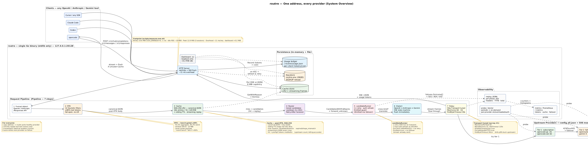

# routre

The 10-MB gateway you forget is running. One static binary (~10 MiB, ~10 MiB RAM idle, bench-gated ≥90% tool-token savings) that gives every OpenAI/Anthropic-compatible CLI — opencode, Claude Code, Codex, Cursor, … — automatic provider failover, RTK token compression (≥90% on tool-heavy traffic), response caching, and a per-agent token/cost ledger. A localhost dashboard at `http://127.0.0.1:20128/ui` lets non-programmers configure it without editing JSON.

```bash
curl -fsSL https://raw.githubusercontent.com/mariobgsp/routre/main/install.sh | sh
routre setup              # wizard: provider URLs + API keys
routre serve              # gateway on 127.0.0.1:20128
routre start              # start the daemon (systemd/launchd or detached)
routre list               # connected providers + token/cost ledger
routre models sync        # pull new provider models into config.json
```

Point any agent at `http://127.0.0.1:20128` via `OPENAI_BASE_URL` /
`ANTHROPIC_BASE_URL` — failover, compression, and caching come for free.

### Latest (v0.3.4 — 2026-08-28)

- **`routre models sync`** — fetches each provider's `GET {base_url}/models` and persists new IDs into `config.json` so a provider's new model works without a manual edit. Additive by default (never removes), `--prune` to drop retired models, `--dry-run`/`--json` for scripting, `routre models diff` as dry-run alias. Discovery still runs every 6h + at startup + on `SIGHUP`; sync just makes it durable across restarts.
- **Zero-config still works without sync** — `forward_unknown: true` (default) forwards any unknown model to all providers with automatic failover, so even before you run `sync` you won't be left behind.

<details><summary>Previous — v0.3.2</summary>

- Enriched 503 surface with per-provider `attempts[]` (shared with `routre doctor`).
- `routre doctor` per-provider probe + per-phase observability + latency hardening.
- `candidateRunner` deep module, streaming `overloaded` double retry, `--debug` trace.

</details>

See [CHANGELOG.md](CHANGELOG.md) for the full version history.

---

## Table of contents

- [Why this exists](#why-this-exists)
- [Install](#install)
- [Quick start](#quick-start)
  - [Local dashboard for non-programmers](#local-dashboard-for-non-programmers)
- [How it works](#how-it-works)
  - [Automatic failover](#automatic-failover)
  - [Keeping models current](#keeping-models-current)
  - [RTK token compression](#rtk-token-compression--90-on-tool-heavy-traffic)
  - [Response cache](#response-cache)
  - [Cross-kind streaming translation (OpenAI ↔ Anthropic)](#cross-kind-streaming-translation-openai--anthropic)
  - [Token & cost ledger](#token--cost-ledger)
  - [Always-on daemon](#always-on-daemon)
- [Configuration](#configuration)
- [Commands](#commands)
- [Benchmarks](#benchmarks)
- [Changelog](#changelog) *(separate file: [`CHANGELOG.md`](CHANGELOG.md))*
- [Project layout](#project-layout)
- [Known gaps](#known-gaps)
- [License](#license)

---

## Why this exists

Built as a decision-driven spike (see [`docs/SPEC.md`](docs/SPEC.md) for the full
decision record and roadmap):

- **Not 9router** — right feature set, but Node/Next.js with ~80 MB idle RAM
  and a documented unbounded leak (~4.8 GB in 3 days), plus unbenchmarked
  20–65% savings claims.
- **Not LiteLLM/Portkey self-host** — Python/Postgres/Redis stacks sized in
  gigabytes.
- **Single static Go binary, stdlib only** — proven low-RAM pattern (Go ~5K
  QPS at ~11 ms proxy overhead), cross-compiled for 6 platforms and shipped
  as GitHub Release assets (curl installer, no Node needed).
- **Honest metrics** — the 90% claim is defined, gated, and reproducible:
  `routre bench` fails the build if it regresses.

---

## Install

### curl (macOS / Linux) — recommended

```bash
curl -fsSL https://raw.githubusercontent.com/mariobgsp/routre/main/install.sh | sh
routre version
```

Downloads the latest GitHub release, verifies its sha256 checksum, and
installs a single static binary to `~/.local/bin` (no sudo; the installer
prints a PATH line if that dir is not already on your PATH). Env overrides:

- `ROUTRE_INSTALL_DIR=/usr/local/bin` — install somewhere else
- `ROUTRE_VERSION=v0.4.0` — pin a specific release

Upgrades are built in: `routre update`. Windows: download the
`routre_windows_*.zip` asset from
[Releases](https://github.com/mariobgsp/routre/releases/latest) and unzip.

### npm (deprecated)

```bash
npm install -g routre   # deprecated — prints the curl command and exits
```

npm packages remain published for pinned dependents but are **deprecated**:
the launcher no longer runs the binary. Uninstall with
`npm uninstall -g routre` and switch to the curl installer.

### From source (developers)

```bash
make build          # needs Go ≥ 1.22
./routre version
```

### Releasing

```bash
tag v0.4.0 && git push origin v0.4.0   # release.yml builds 6 platforms and
                                       # attaches them to the GitHub Release
```

That's the whole pipeline: `release.yml` compiles every platform, stamps the
version, generates `checksums.txt`, and publishes the release — which is
exactly what `install.sh` and `routre update` consume. Test locally with
`make dist-release` first.

### Legacy npm distribution (deprecated)

```bash
make dist-npm       # cross-compiles all 6 platforms → npm/dist/*.tgz (7 packages)
NPM_TOKEN=<token> bash ./npm/publish.sh   # optional: manual publish to the registry
```

Kept only so pinned dependents keep resolving; no release automation remains
for npm. See [Releasing](#releasing) for the current tag-driven pipeline.

---

## Quick start

```bash
routre setup              # interactive: listen addr, providers, URLs, keys, prices
routre check              # validate config + which API keys are set
routre serve              # gateway on 127.0.0.1:20128
routre start --autostart  # start daemon + enable boot/login auto-start
routre stop               # stop the daemon
routre list               # providers + token/cost ledger
routre models sync        # pull new provider models into config.json
routre models diff        # preview what sync would change (no write)
routre update             # self-update to the latest release (-check to peek)
```

`setup` writes two files next to `config.json`:

- `config.json` — providers, tiers, base URLs, models (no secrets)
- `routre.env` — API keys, **0600 permissions**, auto-loaded by
  `serve` / `check` / `list` (no shell exports needed)

### Point a coding agent at it

```bash
export ANTHROPIC_BASE_URL=http://127.0.0.1:20128   # Claude Code
export OPENAI_BASE_URL=http://127.0.0.1:20128      # Codex / opencode / etc.
```

Endpoints: `POST /v1/chat/completions`, `POST /v1/responses`, `POST /v1/messages`,
`GET /v1/models`, `GET /v1/status`, `GET /v1/usage`, `GET /healthz`,
`GET /metrics` (Prometheus). Local dashboard: `GET /ui` (loopback-only, no extra RAM at idle).

`/v1/responses` speaks the OpenAI Responses API (what opencode's built-in
`openai` provider uses) and is translated to `/v1/chat/completions` for the
upstream providers, then wrapped back into the Responses envelope for the
client. It works with `OPENAI_BASE_URL` out of the box.

### Local dashboard for non-programmers

Open `http://127.0.0.1:20128/ui` in a browser — no CLI needed. The page shows live status (RTK/cache/uptime, provider tiers, key presence), a form to set API keys (written to `routre.env`, `0600`), and a validated JSON editor for the full config (`config.json`, atomic write + instant reload). Every change is validated before it is saved; bad JSON is rejected and the previous config is kept. The server binds `127.0.0.1` only, rejects non-loopback `Host`/`Origin` headers (DNS-rebinding/CSRF mitigation), and the dashboard adds ~0 MiB at idle and <2 MiB after use — binary grows from ~7 MiB to ~11 MiB.

```text
routre serve          # then open http://127.0.0.1:20128/ui
```

### Connect everything (opencode-go, opencode zen, OpenRouter)

The repo ships `config.all.json` — a ready config exposing **506 models**
through one endpoint, verified live:

| Provider | Base URL | Models | Key env |
| --- | --- | --- | --- |
| `opencode-go` | `https://opencode.ai/zen/go/v1` | 26 (minimax, kimi, glm, deepseek, qwen, hy3, …) | `OPENCODE_GO_API_KEY` |
| `opencode-zen` | `https://opencode.ai/zen/v1` | 62 (claude-fable-5, gemini, gpt-5.x, grok, free tier, …) | `OPENCODE_GO_API_KEY` |
| `gemini` | `https://generativelanguage.googleapis.com` | 4 (gemini-2.0-flash, …) | `GEMINI_API_KEY` |
| `openrouter` | `https://openrouter.ai/api/v1` | 413 (all OpenRouter models) | `OPENROUTER_API_KEY` |

```bash
cp config.all.json config.json
# routre.env:
#   OPENCODE_GO_API_KEY=<from ~/.local/share/opencode/auth.json>
#   OPENROUTER_API_KEY=<your key>
routre serve
curl http://127.0.0.1:20128/v1/models          # 506 models
# use any model as <provider>/<model>, e.g.:
#   opencode-zen/claude-fable-5  opencode-go/hy3  openrouter/deepseek/deepseek-chat
```

> **Provider-qualified model names.** The `<provider>/` prefix is a
> client-side routing label only — it tells the gateway which configured
> provider to route to — and is **stripped before the request is sent
> upstream**. The upstream always receives the bare listed model name:
> `opencode-go/gpt-5.6-luna` → `gpt-5.6-luna` upstream,
> `openrouter/openai/gpt-5.6-luna` → `openai/gpt-5.6-luna` (multi-slash IDs
> are kept intact — only the first segment is removed). This matches how
> opencode itself resolves `provider/model` (it splits the reference at the
> first `/`).

Tier order: `opencode-go` → `opencode-zen` (subscription), `openrouter`
(fallback). If a model is missing or a provider 5xx/401s, the gateway
fails over automatically.

### Validate without a paid key

```bash
./cmd/mock-upstream/mock-upstream -addr 127.0.0.1:19999   # mock provider
# config with base_url "http://127.0.0.1:19999/v1"
MOCK_KEY=x ./routre serve -config config-mock.json
opencode run --model <provider>/<model> "hello"
```

---

## How it works



> **How it works:** every CLI (`opencode`, `Claude Code`, `Codex`, `Cursor`) hits `routre` on `127.0.0.1:20128` → **format detect** (OpenAI / Anthropic / Responses API) → **RTK 90% filter** (12 heuristic filters, no LM) → **sha256 LRU cache** (exact + streaming replay) → **tiered router** (subscription → cheap → free, 2s→30m cooldown, `Retry-After` honored) → `candidateRunner` (1× retry, auth-refresh-and-retry, Emitted contract) → **dialect translator** (OpenAI ↔ Anthropic in-flight SSE) → **dialects-aware relay** (`http.Transport` tuned: MaxConnsPerHost=64, H2, firstByteTimeout=30s) → upstream. Failures surface through the `failures` module with per-provider breakdown. **Observability:** per-phase `total_ms` (dial/headers/TTFB) in JSONL, Prometheus metrics, periodic probe, `routre doctor`. **Efficiency:** 91.5% tool-token reduction (90.3% worst payload), 10 MiB RAM idle (+0.2 MiB for `/ui`), 10.6 MiB binary, ~11 ms overhead.
> Source: [`docs/architecture.puml`](docs/architecture.puml) (PlantUML, rendered via plantuml.com).

### Automatic failover

- Providers are configured in **tiers** (`subscription` → `cheap` → `free`)
  and tried in order; within a tier, providers are tried in order.
- Failures (5xx, 429, 401/403, network errors) fail over to the next
  provider; the failed one enters an **exponential cooldown** (2 s base →
  30 min cap). Success resets. Cooldowns are per provider — one failing
  provider never cools down the others.
- **Transient blips are retried first**: a network error or 5xx is retried
  once on the same provider (500 ms delay) before failover — an hour-long
  upstream 503 no longer burns every fallback in the same window.
- **Auth rotation is recovered**: on a 401/403 the gateway re-reads the
  `routre.env` key file and, if the API key changed, retries the same
  provider once with the fresh key before failing over.
- **Upstream `Retry-After` is honored**: a 429/5xx carrying a `Retry-After`
  header sets that provider's cooldown to at least the mandated delay
  (it acts as a floor, never shortening the default backoff).
- **Streaming requests fail over too**: an upstream 5xx/429 answered before
  the first stream byte is treated like a non-streaming failure; after the
  first byte, a stream abort stops the request (no duplicated output).
- **Client-caused errors** (400/404/422, e.g. context-length) are surfaced,
  not retried.
- **Honest error identity**: `model_not_found` (503) only when no configured
  provider (and no fallback) can serve the model; when every provider that
  could serve it is cooling down, the gateway returns `providers_unavailable`
  (503) with a `Retry-After` header instead — the remedy is waiting, not
  editing the config.
- **Zero-config model handling** (`forward_unknown: true`, default): a model
  absent from every provider's `models` whitelist is forwarded verbatim to
  available providers in tier order. A provider that does not carry the model
  rejects it (400/404); that rejection is treated as "try the next provider"
  (with no pointless same-provider retry), so a model carried by **any**
  configured provider works with no config edit. If every provider rejects
  it, the last rejection is surfaced. Set `forward_unknown: false` to restore
  strict whitelist behavior (unknown models return `model_not_found`).
- The gateway **holds the provider API keys** (from `api_key_env` /
  `routre.env`) and injects them upstream — a client's `Authorization`
  header is a placeholder and is never forwarded.

### Keeping models current

Three layers, cheapest first:

1. **`forward_unknown: true` (default)** — any model not in `config.json` is forwarded verbatim to every available provider in tier order. If one provider carries it, the request succeeds with no config edit; rejections (400/404) fail over automatically.
2. **In-memory discovery** — at startup, every 6h, and on `SIGHUP`, each provider's `GET {base_url}/models` is fetched and merged additively into the live router. No restart needed, but not yet durable.
3. **`routre models sync`** — makes discovery durable by writing new IDs back into `config.json`:

   ```bash
   routre models diff -config config.json          # preview
   routre models sync -config config.json          # +12 models → writes + SIGHUPs gateway
   routre models sync --prune --dry-run --json     # scripting
   ```

   Additive by default (never deletes). `--prune` drops models the provider no longer advertises. Unreachable providers are skipped with a warning and kept as-is. After a successful write the gateway is `SIGHUP`'d best-effort so the new list is live immediately.

### RTK token compression (≥90% on tool-heavy traffic)

Heuristic compression of `tool_result` content — no local LM, no network
calls:

| Filter | Rule |
| --- | --- |
| git-diff | 10 changed lines/hunk cap + 80/30 head/tail trim |
| git-log | dedup + 50/15 trim |
| grep | dedup + 80/40 trim |
| tree / ls / find / git-status | dedup |
| build-output | dedup + 50/25 trim |
| read-numbered / search-list | dedup |
| smart-truncate (fallback) | head 120 / tail 60 |

Safety contract: **fail-open** (malformed JSON passes through), **never
grows** a payload, 500 B–10 MiB window, per-request safe. The `bench`
command measures reduction on 5 realistic tool-heavy payloads and gates
**both the aggregate (91.5%) and the worst per-payload (90.3%)** at ≥90%.

### Response cache

- Exact-match LRU keyed by SHA-256 of the **processed** body (post-RTK).
  Defaults: 512 entries / 1 h TTL / 8 MiB max entry; the shipped
  `config.all.json` uses 4096 entries / 24 h TTL / 64 MiB budget.
- **Streaming replay cache.** Successful streaming responses are captured as
  client-dialect SSE bytes (same 8 MiB per-entry cap) and an identical later
  streaming request is replayed byte-for-byte from memory — no upstream call,
  `X-Llrouter-Cache: hit`, saved tokens credited to the ledger exactly like
  non-streaming hits. Replay is byte-identical, so tool-call ids,
  `finish_reason` and `[DONE]` stay self-consistent by construction.
  Mid-stream aborts (upstream died after first byte) are never cached —
  they surface as stream aborts and the next request goes upstream again.
  Streaming and non-streaming entries share one key space but never cross:
  a JSON entry is only served to non-streaming requests and an SSE entry
  only to streaming requests.
- Optional `prefix_order` moves system messages first for stable keys and
  stable upstream prompt-cache prefixes.
- Optional `prompt_cache` (Anthropic outbound only) injects
  `cache_control {type:"ephemeral"}` breakpoints on the system prefix and
  last message, so repeat agentic prefixes are billed at the cache-read
  rate. Off by default; strictly additive (an existing `cache_control` is
  never overwritten).
- Cache hits record their token savings in the ledger — credited with the
  **upstream-reported** prompt token count stored on the cached response,
  so the ledger matches the provider's billing numbers instead of
  length-based estimates.

### Cross-kind streaming translation (OpenAI ↔ Anthropic)

An agent pinned to the **OpenAI dialect** can stream from an Anthropic
provider and vice versa: when the client and upstream speak different
API dialects, the gateway rewrites the event stream in flight.

- **In-flight SSE state machine** — never buffers the whole response.
  Frames are translated as they arrive and flushed immediately (no
  tail-latency cost), keeping memory flat for long streams.
- **Tool-call fidelity**: `tool_use_id` ↔ `tool_call_id` round-trips
  **unchanged** (no gateway-generated ids), so agent tool loops work
  across dialects. Partial JSON tool arguments
  (`input_json_delta` / `tool_calls[].arguments`) pass through verbatim;
  the client accumulates them.
- **Honest termination**: Anthropic `message_delta`/`error` → OpenAI
  `finish_reason` (`max_tokens→length`, `end_turn→stop`, `error→content_filter`)
  and the reverse; every stream ends with `[DONE]`.
- **Failover contract preserved**: strictly retryable before the first
  byte reaches the client; after the first byte the stream can't fail over
  (no duplicated output) — same rule as same-kind streaming.
- Usage tokens are captured from the stream for both dialects, so the
  ledger records real completion counts instead of zeros.

Non-streaming cross-kind requests fall back to lossy translation
(flat tool output, no `tool_call_id` link) for cheap-tier fallback —
fine for one-shot prompts, but streaming is the preferred path for
cross-kind tool loops.

### Token & cost ledger

Per coding agent (by User-Agent): requests, tokens in/out, RTK savings,
cache savings, and estimated cost.

- Persisted to `~/.routre/usage.json` — survives restarts, **autosaved
  every 60 s and on SIGHUP**, so a crash loses at most one minute of
  ledger. Works offline from the persisted file when the gateway is down.
- Costs come from provider-reported usage (OpenRouter reports real
  `usage.cost`) or from `price_in` / `price_out` in the config (USD per 1M
  tokens).
- Tail per-request detail with `routre logs`, see the ledger with
  `routre list`.

### Observability

`GET /metrics` serves Prometheus exposition text — useful for dashboards and
uptime checks. It reports: uptime seconds, request totals by
client/provider/model/outcome class, upstream failover totals by
provider/class, cache hits/misses and the hit ratio, RTK compression applied
count and saved tokens, and provider-reported prompt-cache read tokens. The
per-request JSONL log (`request_log` in config, tailed with
`routre logs`) and the `/v1/status` + `/v1/usage` JSON endpoints cover
the structured detail.

**Per-phase latency (v0.3.2+).** Every JSONL log line carries:

| Field | Meaning |
| --- | --- |
| `dial_ms` | time spent establishing the upstream connection |
| `headers_ms` | time to receive upstream response headers |
| `ttfb_ms` | time to first body byte (streaming only) |
| `total_ms` | the whole attempt (end-to-end) |
| `latency_ms` | end-to-end from request to log (kept for back-compat) |

Currently `total_ms` is populated (single measurement around the relay
call); the three phase fields are plumbed and ready for `httptrace.ClientTrace`
wiring. Filter the live log with `routre logs -errors` (failures only) or
`routre logs -provider <name>` (per-provider).

### Always-on daemon

- `deploy/routre.service` + `deploy/routre.socket` (systemd;
  socket activation → ~0 MB idle) and `deploy/dev.routrecli.daemon.plist`
  (launchd for macOS). `MemoryMax` guard included.
- **SIGHUP reloads config + env** without dropping connections (SIGINT /
  SIGTERM = graceful shutdown, ledger saved first).
- `routre start [--autostart]`, `stop [--autostart]`, and `restart`
  manage the daemon through systemd (system or `--user` scope) or launchd;
  without an installed service they fall back to a detached background
  process logging to `~/.routre/daemon.log`.

### Security (optional gateway auth)

The gateway binds `127.0.0.1` by default, so it is only reachable from the
local machine — but any local process could still send requests through it
and burn your provider keys. For shared machines or extra hardening you can
enable a **shared secret**:

```jsonc
"auth": { "secret_env": "ROUTRE_SECRET", "header": "X-Routre-Key" }
```

With `auth.secret_env` set, every `/v1/*` request must carry the matching
secret in the configured header (or `Authorization: Bearer <secret>`);
mismatches get a `401 invalid_api_key` with no upstream call. `/healthz`
and `/metrics` stay open for probes/scrapers. The secret lives in
`routre.env` (0600), never in the config.

`routre setup` offers to enable this and generates a random secret.
When enabled, `routre serve` also mints a one-time **process token**
(`~/.routre/auth.tok`, 0600, regenerated each start) so the local
`list`/`check`/`logs` commands keep working without you pasting the secret
into flags.

---

## Configuration

```jsonc
{
  "listen": "127.0.0.1:20128",
  "rtk":   { "enabled": true, "min_bytes": 500, "max_bytes": 10485760 },
  "cache": { "enabled": true, "max_entries": 512, "ttl_seconds": 3600, "prefix_order": false },
  "tiers": [
    { "name": "subscription", "providers": [
      { "name": "openrouter", "kind": "openai",
        "base_url": "https://openrouter.ai/api/v1",
        "api_key_env": "OPENROUTER_API_KEY",
        "models": ["tencent/hy3"],
        "price_in": 0, "price_out": 0 }   // USD per 1M tokens; 0 = unknown
    ]}
  ]
}
```

| Field | Meaning |
| --- | --- |
| `kind` | `openai` or `anthropic` (dialect translation for cross-kind fallback) |
| `api_key_env` | env var holding the key — loaded from `routre.env` or shell |
| `price_in` / `price_out` | USD per 1M tokens for cost reporting (optional) |
| `tiers` order | fallback order; keep subscription/cheap/free |

A full reference config with 506 models lives in `config.all.json`; a
minimal template is `config.example.json` (also in `examples/`).

---

## Commands

| Command | Purpose |
| --- | --- |
| `routre setup [-config f]` | interactive wizard (providers, URLs, API keys) |
| `routre serve [-config f] [-port :p] [--debug]` | run the gateway in the foreground (`--debug` / `ROUTRE_DEBUG=1`) |
| `routre start [-config f] [--autostart]` | start the daemon (systemd/launchd, or detached process) |
| `routre stop [-config f] [--autostart]` | stop the daemon (+ disable auto-start) |
| `routre restart [-config f]` | restart the daemon (keeps auto-start state) |
| `routre check [-config f]` | validate config + API keys |
| `routre doctor [-config f]` | probe every provider (per-provider `ok`/`overloaded`/`auth` with cooldown) |
| `routre list [-config f] [-url u]` | connected providers + token/cost ledger |
| `routre models sync [-config f] [--dry-run] [--prune] [--json]` | fetch `GET /v1/models` per provider and persist new IDs to `config.json` |
| `routre models diff [-config f]` | dry-run alias for `models sync --dry-run` |
| `routre logs [-n 50] [-f] [-errors] [-provider <name>] [-config f]` | tail the per-request log |
| `routre bench [-config f] [-target 90]` | RTK token-reduction benchmark (gated) |
| `routre update [-check]` | self-update: download + verify + atomically replace this binary |
| `http://127.0.0.1:20128/ui` | local dashboard: status, providers, keys, full config editor — loopback-only |
| `routre version` | print version |

### `list` — everything connected, per agent, with totals

```text
== configured providers ==
  [subscription] openrouter  openai  key ok  models=tencent/hy3,... cost n/a

== live gateway ==
  openrouter     up

== token & cost ledger ==
  source: live

  codex
    requests: 2
    consumed: 58 tokens (18 in + 40 out)
    saved:    3351 tokens (rtk 2308 + cache 1043)
    cost:     n/a (no prices configured)   saved: n/a
    by provider/model:
      codex/tencent/hy3  2 req  58 tok  saved 3351

  opencode
    requests: 4
    consumed: 112 tokens (62 in + 50 out)
    saved:    28 tokens (rtk 0 + cache 28)
    cost:     $0.000021   saved: $0.000000

  TOTAL
    requests: 6
    consumed: 170 tokens   saved: 3379 tokens (95.2%)
    cost:     $0.000021   saved: $0.000000
```

---

## Benchmarks

Measured on this machine, 2026-08-15:

| Metric | Result | Target |
| --- | --- | --- |
| RTK tool-token reduction (bench, 5 tool-heavy payloads) | **91.5%** | ≥ 90% (aggregate **and** per-payload) |
| Worst per-payload tool reduction | 90.3% (tree-ls) | ≥ 90% |
| RTK payload-token reduction (whole request bodies) | **91.3%** | reported |
| Idle RSS (`scripts/measure-ram.sh`) | **10 MiB** (was 9 MiB pre-UI) | ≤ 100 MiB |
| Peak RSS under live opencode load (3 sessions) | 12.9 MiB | ≤ 200 MiB hard cap |
| Binary size (`CGO_ENABLED=0`, `-s -w`) | **10.6 MiB** (was 6.7 MiB pre-UI) | small |
| Dashboard RAM delta (idle → after serving /ui once) | **+0.2 MiB** | <2 MiB |
| Tests | all pass (`go test ./...`) | — |
| OpenCode 1.18.15 e2e → gateway → upstream | answer delivered, exit 0 | — |
| RTK on a real 23.4 KB tool_result request | 5.4 KB sent upstream | fail-open |
| Cache on identical repeat request | served from cache, upstream untouched | — |
| Real OpenRouter paid round-trip (with your key) | 200, usage + cost recorded | — |

Reproduce:

```bash
make build test bench        # bench gates 90% (fails on regression)
./scripts/measure-ram.sh ./routre ./config.example.json 30
```

---

## Project layout

```text
main.go                  CLI (setup/serve/check/start/stop/restart/list/bench/update/models/version)
bench.go                 RTK benchmark + 90% gate
setup.go                 interactive setup wizard
start.go                 daemon start/restart (systemd/launchd/detached spawn)
stop.go                  daemon stop (systemd/launchd/port scan + SIGTERM)
list.go                  providers + per-agent token/cost ledger
models.go                `models sync/diff` — durable model discovery
update.go                `update` subcommand (self-update driver)
install.sh               curl installer (latest release → ~/.local/bin)
internal/update/         release discovery, checksums, atomic replace
internal/config/         JSON config + routre.env + SIGHUP reload
internal/router/         tiers, failover, cooldowns (exponential backoff)
internal/rtk/            token compression (12 filters + autodetect)
internal/cache/          exact-match LRU + prefix ordering
internal/proxy/          HTTP gateway, SSE relay, key injection, translation, loopback-only /ui dashboard, candidateRunner (retry/refresh/Emitted), per-phase Phases
internal/proxy/dialect/  cross-kind SSE state machine (OpenAI ↔ Anthropic ↔ Gemini)
internal/proxy/failures/ shared failure.Outcome shape + 3 render functions (wire 503/404, human doctor)
internal/usage/          token/cost ledger (persisted to ~/.routre/)
internal/tokenize/       token estimator (benchmark instrument)
internal/mock/           mock upstream (tests + keyless e2e)
benchdata/               tool-heavy request bodies for the bench gate
scripts/measure-ram.sh   RSS/peak/growth measurement
deploy/                  systemd unit+socket, launchd plist
.github/workflows/       ci.yml (tests) · release.yml (v* tag → GitHub Release assets)
npm/                     DEPRECATED npm distribution (kept for pinned dependents)
```

---

## Known gaps (full detail in docs/SPEC.md)

- Gemini is a streaming dialect for **OpenAI↔Gemini** and
  **Anthropic↔Gemini** (request + non-streaming response + in-flight SSE
  translation with guaranteed termination); a gemini-kind provider can now
  serve both OpenAI- and Anthropic-dialect clients.
- Token estimates are an approximation (≈4 bytes/token) — a benchmark
  instrument, not billing-grade (tiktoken integration is planned).
- 90% is measured on tool-result tokens; output tokens are never
  compressed, so real-session savings depend on the tool-traffic mix
  (this is exactly what `routre list` shows you).
- 401/403 **token refresh** is implemented (re-reads the env key file and
  retries once on rotation); cooldown + failover still apply when the key is
  unchanged or still rejected.
- **Windows self-update is deferred**: `routre update` on Windows prints
  a re-install hint instead of replacing the running .exe (rename-swap
  support tracked for a later release); win32 binaries are still shipped on
  every release for manual install.

## Changelog

See [`CHANGELOG.md`](CHANGELOG.md) for the release history (all versions,
including unreleased changes).

---

## License

MIT — see [LICENSE](LICENSE). (The RTK filter approach is a clean-room
reimplementation of the MIT-licensed 9router `open-sse/rtk` ideas.)

---

See [`docs/SPEC.md`](docs/SPEC.md) for the full decision record, metric definitions,
failover policy table, and validation roadmap.
