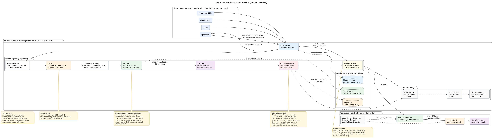
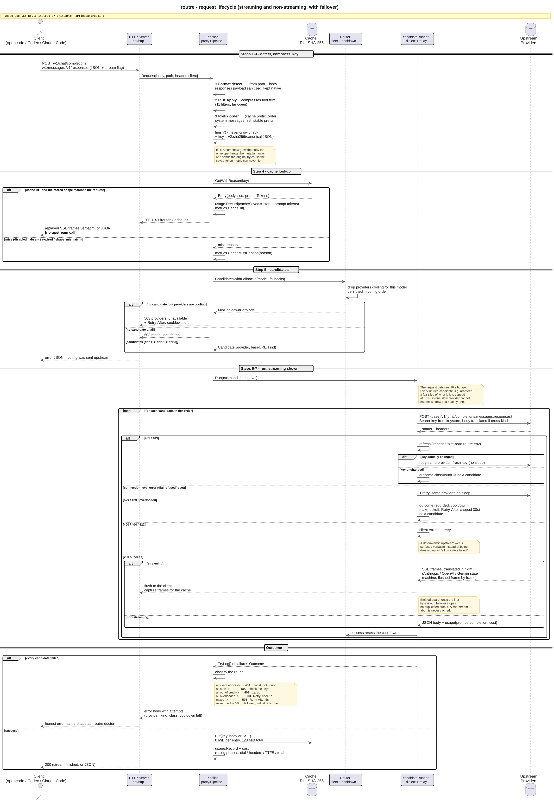
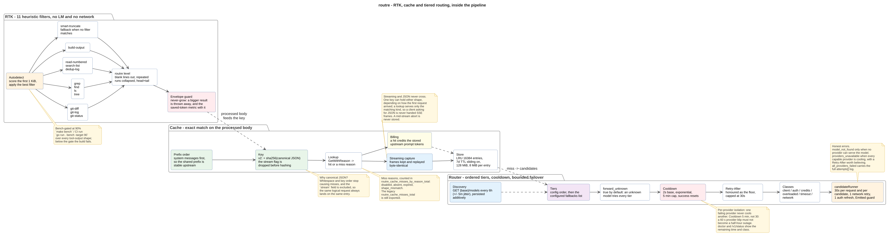

# How routre works

Deep internals for `routre` — the request pipeline, failover policy, RTK
compression, cache, cross-dialect translation, observability, and footprint.
For install/quickstart see the [README](../README.md).

> One binary, 7 steps, zero config: every CLI hits `127.0.0.1:20128` → detect
> → compress → cache → route → retry → translate → relay. Failover,
> compression, and caching come for free.

- [The 7-step pipeline](#the-7-step-pipeline)
- [Request lifecycle](#request-lifecycle)
- [Automatic failover](#automatic-failover)
- [Keeping models current](#keeping-models-current)
- [RTK token compression](#rtk-token-compression)
- [Response cache](#response-cache)
- [Cross-dialect translation](#cross-dialect-translation)- [Token & cost ledger](#token--cost-ledger)
- [Observability](#observability)
- [Always-on daemon](#always-on-daemon)
- [Security](#security-optional-gateway-auth)
- [Benchmarks](#benchmarks)
- [Project layout](#project-layout)
- [Known gaps](#known-gaps)

---

## The 7-step pipeline



*Sources: [`architecture.puml`](architecture.puml) · rendered with PlantUML
`smetana` (no Graphviz). All diagrams are versioned as `.puml` + `.png`.*

| Step | What happens | Where in code |
|------|--------------|---------------|
| **1 — Format detect** | `OpenAI / Anthropic / Responses API` detected from path + body; `/v1/responses` → OpenAI translation | `internal/proxy/dialect/` |
| **2 — RTK** | 12 heuristic filters on `tool_result` bodies — ≥90% fewer tokens, fail-open, no LM, 500 B–10 MiB window | `internal/rtk/` |
| **3 — Cache** | SHA-256 of canonical JSON (post-RTK) → LRU hit/miss; streaming & JSON never cross; `shape_mismatch` tracked | `internal/cache/` |
| **4 — Router** | Tiered `subscription → cheap → free`, per-provider cooldown `2s→30m`, `Retry-After` honored, `forward_unknown` | `internal/router/` |
| **5 — candidateRunner** | 1× immediate connection-level retry + 1 free auth-refresh on 401/403 + `Emitted` guard; failover budget up to 15 s per candidate, or an equal share of the 30 s request budget while providers remain | `internal/proxy/runner.go` |
| **6 — Dialect** | OpenAI ↔ Anthropic ↔ Gemini SSE state machine, flushed frame-by-frame, no buffering | `internal/proxy/dialect/` |
| **7 — Relay** | `http.Transport` tuned (MaxConns 64, H2); first-byte watchdog bounded by the candidate's slice, then a 5-minute generation backstop | `internal/proxy/` |

> **Observability** (left out of the hot path): per-phase
> `dial_ms / headers_ms / ttfb_ms / total_ms` → JSONL, `GET /metrics`
> (Prometheus), `routre doctor` + `probe`. **Footprint**: ~10.6 MiB binary,
> ~10 MiB idle RSS, ~26 ms p50 added on a 1 MiB tool-heavy body.

---

## Request lifecycle



*Source: [`request-lifecycle.puml`](request-lifecycle.puml)*



*Source: [`cache-rtk-routing.puml`](cache-rtk-routing.puml)*

Per request, read left → right, top → bottom:

1. **Ingest & compress** — body → format detect → RTK (strictly never grows).
2. **Cache lookup** — `keyFor(CanonicalJSON(post-RTK))` → `GetWithReason` → hit =
   immediate replay (`X-Llrouter-Cache: hit`, no upstream); miss reason emitted
   as `routre_cache_misses_by_reason_total{reason}`.
3. **Candidate selection** — `Router.CandidatesWithFallbacks(model)` respects
   tiers, cooldowns, and `forward_unknown` (unknown model tries every tier).
4. **Failover loop** — each candidate is bounded by the failover budget: up to
   15 s, or an equal share of the 30 s request budget while several providers
   remain (3 candidates ⇒ ~10 s each, 6 ⇒ ~5 s). That window covers the wait
   for the upstream's response headers AND for its first body byte, while the
   gateway is still choosing a candidate; once a first byte lands the
   generation may finish under a 5-minute backstop. Then: try → on `401/403`
   refresh the `routre.env` key and retry once → on a connection-level error
   retry once immediately (no sleep) → on `5xx`/`429` fail over without a
   same-candidate retry → on `400/404/422` surface immediately → on `200`
   capture SSE frames with in-flight dialect translation and flush. Once the
   first byte is emitted, failover is *disabled* (no duplicated output);
   mid-stream aborts are never cached.
5. **All-failed → honest error** — `model_not_found` (no provider can serve) vs
   `providers_unavailable` (every capable provider cooling, `Retry-After` tells
   you to wait) vs `all_providers_failed` with full `attempts[]` the same shape
   `doctor` shows.

---

## Automatic failover

- Providers are configured in **tiers** (`subscription` → `cheap` → `free`) and
  tried in order; within a tier, providers are tried in order.
- Failures (5xx, 429, 401/403, network errors) fail over to the next provider;
  the failed one enters an **exponential cooldown** (2 s base → 30 min cap).
  Success resets. Cooldowns are per provider — one failing provider never cools
  down the others.
- **Only connection-level errors are retried**: a dial refused/reset or an
  unroutable host is retried once on the same provider, immediately (no sleep)
  and only while it fits that candidate's share of the budget. A 5xx/429/
  overloaded response fails over instead. Each candidate gets a fair slice of
  the request budget, so one provider's retry can never starve an untried
  healthy one.
- **The failover budget bounds candidate selection, not the generation**: each
  candidate gets up to 15 s, or an equal share of the 30 s request budget while
  several providers remain — whichever is smaller. That window covers the wait
  for the upstream's response headers and for its first body byte, and it is
  spent once: the header wait and the first byte draw on the same slice. Once a
  first byte has arrived the timer stops and only the 5-minute generation
  backstop applies, so a legitimate long generation is never killed — a client
  can therefore see a request run past 30 s. If the budget runs out before a
  candidate is tried, the 503 says so with a `failover_budget` attempt instead
  of blaming a provider that was never asked.
- **Auth rotation is recovered**: on a 401/403 the gateway re-reads the
  `routre.env` key file and, if the API key changed, retries the same provider
  once with the fresh key before failing over.
- **Upstream `Retry-After` is honored**: a 429/5xx carrying a `Retry-After`
  header sets that provider's cooldown to at least the mandated delay (a floor,
  never shortening the default backoff).
- **Streaming requests fail over too**: an upstream 5xx/429 answered before the
  first stream byte is treated like a non-streaming failure; after the first
  byte, a stream abort stops the request (no duplicated output).
- **Client-caused errors** (400/404/422, e.g. context-length) are surfaced, not
  retried.
- **Honest error identity**: `model_not_found` (503) only when no configured
  provider (and no fallback) can serve the model; when every provider that could
  serve it is cooling down, the gateway returns `providers_unavailable` (503)
  with a `Retry-After` header instead — the remedy is waiting, not editing the
  config.
- **Zero-config model handling** (`forward_unknown: true`, default): a model
  absent from every provider's `models` whitelist is forwarded verbatim to
  available providers in tier order. A provider that does not carry the model
  rejects it (400/404); that rejection is treated as "try the next provider",
  so a model carried by **any** configured provider works with no config edit.
  Set `forward_unknown: false` to restore strict whitelist behavior.
- The gateway **holds the provider API keys** (from `api_key_env` /
  `routre.env`) and injects them upstream — a client's `Authorization` header is
  a placeholder and is never forwarded.

---

## Keeping models current

Three layers, cheapest first:

1. **`forward_unknown: true` (default)** — any model not in `config.json` is
   forwarded verbatim to every available provider in tier order. If one provider
   carries it, the request succeeds with no config edit; rejections (400/404)
   fail over automatically.
2. **In-memory discovery** — at startup, every 6h (±5m jitter so a fleet never
   hammers providers in lockstep), and on `SIGHUP`, each provider's
   `GET {base_url}/models` is fetched and merged additively into the live router.
   No restart needed, but not yet durable. Every run logs `model discovery:
   refreshed N providers, +M models`; freshness is observable via
   `routre_discovery_last_success_timestamp_seconds` in `/metrics` and
   `discovery_last_success` in `/v1/status`.
3. **`routre models sync`** — makes discovery durable by writing new IDs back
   into `config.json`:

   ```bash
   routre models diff -config config.json          # preview
   routre models sync -config config.json          # +12 models → writes + SIGHUPs gateway
   routre models sync --prune --dry-run --json     # scripting
   ```

   Additive by default (never deletes). `--prune` drops models the provider no
   longer advertises. Unreachable providers are skipped with a warning and kept
   as-is. After a successful write the gateway is `SIGHUP`'d best-effort so the
   new list is live immediately. For set-and-forget durability, run sync on a
   schedule (additive = safe to automate):

   ```cron
   17 */6 * * * ~/.local/bin/routre models sync -config ~/routre/config.json >> ~/.routre/models-sync.log 2>&1
   ```

---

## RTK token compression

Heuristic compression of `tool_result` content — no local LM, no network calls:

| Filter | Rule |
| --- | --- |
| git-diff | 10 changed lines/hunk cap + 80/30 head/tail trim |
| git-log | dedup + 50/15 trim |
| grep | dedup + 80/40 trim |
| tree / ls / find / git-status | dedup |
| build-output | dedup + 50/25 trim |
| read-numbered / search-list | dedup |
| smart-truncate (fallback) | head 120 / tail 60 |

Safety contract: **fail-open** (malformed JSON passes through), **never grows** a
payload, 500 B–10 MiB window, per-request safe. The `bench` command measures
reduction on 5 realistic tool-heavy payloads and gates **both the aggregate
(91.5%) and the worst per-payload (90.3%)** at ≥90%.

Internals: autodetect `tool_result` kind → matched filter → fail-open guard.

---

## Response cache

- Exact-match LRU keyed by SHA-256 of the **processed** body (post-RTK).
  Defaults: 512 entries / 1 h TTL / 8 MiB max entry; the shipped
  `config.all.json` uses 4096 entries / 24 h TTL / 64 MiB budget.
- **Streaming replay cache.** Successful streaming responses are captured as
  client-dialect SSE bytes and an identical later streaming request is replayed
  byte-for-byte from memory — no upstream call, `X-Llrouter-Cache: hit`, saved
  tokens credited to the ledger exactly like non-streaming hits. Replay is
  byte-identical, so tool-call ids, `finish_reason` and `[DONE]` stay
  self-consistent by construction. Mid-stream aborts are never cached. Streaming
  and non-streaming entries share one key space but never cross.
- Optional `prefix_order` moves system messages first for stable keys and stable
  upstream prompt-cache prefixes.
- Optional `prompt_cache` (Anthropic outbound only) injects
  `cache_control {type:"ephemeral"}` breakpoints on the system prefix and last
  message, so repeat agentic prefixes are billed at the cache-read rate. Off by
  default; strictly additive.
- Cache keys use a canonical JSON round-trip (sorted keys, stable numbers, `<` `>`
  `&` left literal so a JS client's body never grows), versioned `v2:`.
- Cache hits record their token savings in the ledger — credited with the
  **upstream-reported** prompt token count stored on the cached response, so the
  ledger matches the provider's billing numbers.

---

## Cross-dialect translation

An agent pinned to the **OpenAI** dialect can stream from an Anthropic provider
and vice versa: when the client and upstream speak different API dialects, the
gateway rewrites the event stream in flight.

- **In-flight SSE state machine** — never buffers the whole response. Frames are
  translated as they arrive and flushed immediately, keeping memory flat for
  long streams.
- **Tool-call fidelity**: `tool_use_id` ↔ `tool_call_id` round-trips
  **unchanged** (no gateway-generated ids), so agent tool loops work across
  dialects. Partial JSON tool arguments pass through verbatim.
- **Honest termination**: Anthropic `message_delta`/`error` → OpenAI
  `finish_reason` (`max_tokens→length`, `end_turn→stop`, `error→content_filter`)
  and the reverse; every stream ends with `[DONE]`.
- **Failover contract preserved**: strictly retryable before the first byte
  reaches the client; after the first byte the stream can't fail over (no
  duplicated output).
- Usage tokens are captured from the stream for both dialects.

> **Known gap**: non-streaming cross-kind translation is lossy. An Anthropic
> client (`/v1/messages`) routed to an **OpenAI** provider currently receives
> the raw OpenAI body (the non-streaming matrix translates `gemini→*` and
> `anthropic→openai`, but not `openai→anthropic`; the streaming path does).
> `tests/e2e_test.go` pins this gap so a future fix is caught.

---

## Token & cost ledger

Per coding agent (by User-Agent): requests, tokens in/out, RTK savings, cache
savings, and estimated cost.

- Persisted to `~/.routre/usage.json` — survives restarts, **autosaved every
  60 s and on SIGHUP**, so a crash loses at most one minute of ledger. Works
  offline from the persisted file when the gateway is down.
- Costs come from provider-reported usage (OpenRouter reports real `usage.cost`)
  or from `price_in` / `price_out` in the config (USD per 1M tokens).
- Tail per-request detail with `routre logs`, see the ledger with `routre list`.

---

## Observability

`GET /metrics` serves Prometheus exposition text — uptime seconds, request totals
by client/provider/model/outcome class, upstream failover totals, cache
hits/misses and hit ratio, RTK compression applied + saved tokens, and
provider-reported prompt-cache read tokens. Distinct model labels are capped at
512 (overflow folds into `_other`; configured models are never folded). The
per-request JSONL log (`request_log` in config, tailed with `routre logs`) and
the `/v1/status` + `/v1/usage` JSON endpoints cover structured detail.

Every JSONL log line carries per-phase latency: `dial_ms` (upstream connection),
`headers_ms` (response headers), `ttfb_ms` (first body byte, streaming only), and
`total_ms` (the whole attempt). Filter with `routre logs -errors` (failures only)
or `routre logs -provider <name>`.

---

## Always-on daemon

- `deploy/routre.service` + `deploy/routre.socket` (systemd; socket activation →
  ~0 MB idle) and `deploy/dev.routrecli.daemon.plist` (launchd for macOS).
  `MemoryMax` guard included.
- **SIGHUP reloads config + env** without dropping connections (SIGINT / SIGTERM
  = graceful shutdown, ledger saved first).
- `routre start [--autostart]`, `stop [--autostart]`, and `restart` manage the
  daemon through systemd (system or `--user` scope) or launchd; without an
  installed service they fall back to a detached background process logging to
  `~/.routre/daemon.log`.

---

## Security (optional gateway auth)

The gateway binds `127.0.0.1` by default — only reachable from the local machine
— but any local process could send requests through it and burn your provider
keys. For shared machines you can enable a **shared secret**:

```jsonc
"auth": { "secret_env": "ROUTRE_SECRET", "header": "X-Routre-Key" }
```

With `auth.secret_env` set, every `/v1/*` request must carry the matching secret
in the configured header (or `Authorization: Bearer <secret>`); mismatches get a
`401 invalid_api_key` with no upstream call. `/healthz` and `/metrics` stay open
for probes. The secret lives in `routre.env` (0600), never in the config. When
enabled, `routre serve` also mints a one-time **process token**
(`~/.routre/auth.tok`, 0600) so the local `list`/`check`/`logs` commands keep
working.

The `/ui` dashboard is loopback-only, rejects non-loopback `Host`/`Origin`
headers (DNS-rebinding/CSRF mitigation), and adds ~0 MiB at idle.

---

## Benchmarks

Measured on this machine:

| Metric | Result | Target |
| --- | --- | --- |
| RTK tool-token reduction (bench, 5 tool-heavy payloads) | **91.5%** | ≥ 90% (aggregate **and** per-payload) |
| Worst per-payload tool reduction | 90.3% (tree-ls) | ≥ 90% |
| RTK payload-token reduction (whole request bodies) | **91.3%** | reported |
| Idle RSS (`scripts/measure-ram.sh`) | **10 MiB** | ≤ 100 MiB |
| Peak RSS under live opencode load (3 sessions) | 12.9 MiB | ≤ 200 MiB hard cap |
| Binary size (`CGO_ENABLED=0`, `-s -w`) | **10.6 MiB** | small |
| Gateway-added latency (1 MiB body) | ~26 ms p50 / ~28 ms p99 | small |

Reproduce:

```bash
make build test bench        # bench gates 90% (fails on regression)
./scripts/measure-ram.sh ./routre ./config.example.json 30

# Gateway-added latency harness:
ROUTRE_ASSERT_LATENCY=1 go test ./internal/proxy -run=^$ -bench=GatewayAddedLatency1MB -benchtime=50x
```

---

## Project layout

```text
main.go                  CLI dispatch + serve (gateway boot)
bench.go                 RTK benchmark + 90% gate
setup.go                 interactive setup wizard
start.go / stop.go       daemon lifecycle (systemd/launchd/detached)
list.go                  providers + per-agent token/cost ledger
logs.go                  per-request log tail
models.go                `models sync/diff` — durable model discovery
update.go                `update` subcommand (self-update driver)
install.sh               curl installer (latest release → ~/.local/bin)
internal/update/         release discovery, checksums, atomic replace
internal/config/         JSON config + routre.env + SIGHUP reload
internal/router/         tiers, failover, cooldowns (exponential backoff)
internal/rtk/            token compression (12 filters + autodetect)
internal/cache/          exact-match LRU + prefix ordering
internal/proxy/          HTTP gateway, SSE relay, key injection, /ui dashboard,
                         candidateRunner (retry/refresh/Emitted), per-phase Phases
internal/proxy/dialect/  cross-dialect SSE state machine (OpenAI ↔ Anthropic ↔ Gemini)
internal/proxy/failures/ shared failure.Outcome shape + render helpers
internal/usage/          token/cost ledger (persisted to ~/.routre/)
internal/tokenize/       token estimator: exact BPE ≤64 KiB, estimate above
internal/mock/           mock upstream (unit tests + e2e harness)
tests/                   binary-level e2e suite (drives the real `routre serve`)
benchdata/               tool-heavy request bodies for the bench gate
scripts/measure-ram.sh   RSS/peak/growth measurement
deploy/                  systemd unit+socket, launchd plist
.github/workflows/       ci.yml (tests) · release.yml (v* tag → GitHub Release)
```

---

## Known gaps

- Gemini is a streaming dialect for **OpenAI↔Gemini** and
  **Anthropic↔Gemini**; a gemini-kind provider can serve both OpenAI- and
  Anthropic-dialect clients. Non-streaming **openai→anthropic** client
  translation is not implemented (see Cross-dialect translation).
- Token estimates are an approximation (≈4 bytes/token) — a benchmark instrument,
  not billing-grade.
- 90% is measured on tool-result tokens; output tokens are never compressed, so
  real-session savings depend on the tool-traffic mix (this is exactly what
  `routre list` shows you).
- 401/403 **token refresh** is implemented (re-reads the env key file and
  retries once on rotation); cooldown + failover still apply when the key is
  unchanged or still rejected.
- **Windows self-update is deferred**: `routre update` on Windows prints a
  re-install hint instead of replacing the running .exe; win32 binaries are still
  shipped on every release for manual install.
